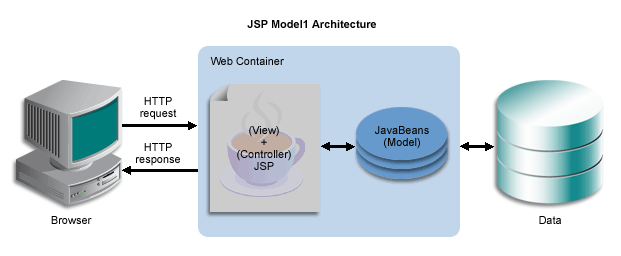
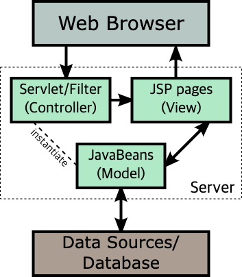
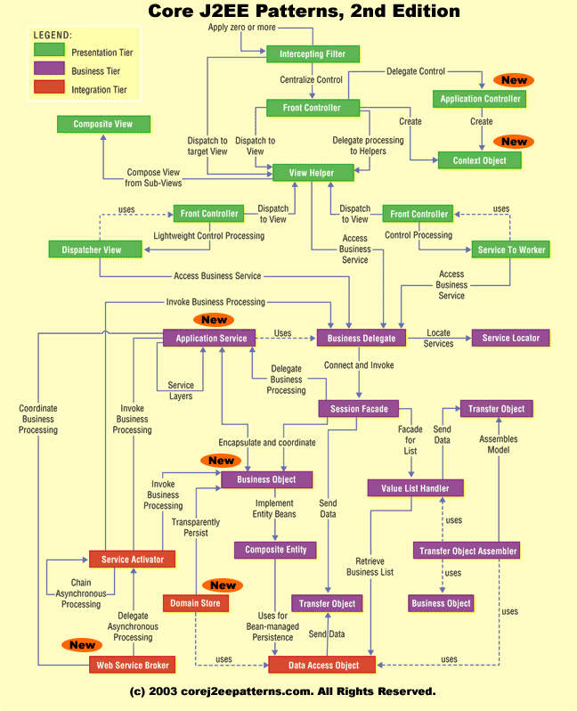
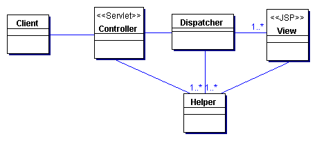
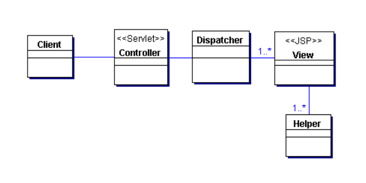

## 적어도 MVC 모델은 적용해야죠

- J2EE 패턴을 공부하려면, MVC 모델에 대해 먼저 이해해야한다.<br>
J2EE 패턴은 MVC 모델을 기반으로 만들어졌기 때문이다.


- 요즘 사용하는 Spring MVC도 매우 인기가 있기 때문이다.

MVC는 Model, View, Controller의 약자이다. <br>
- 하나의 JSP나 스윙처럼 화면에 모든 로직을 모아두는 것이 아니라, <br>
모델 역할, 뷰 열할, 컨트롤러 역할을 하는 클래스를 각각 만들어서 사용한다. 


- **뷰**는 사용자가 결과를 보거나 입력하는 페이지다.
- **컨트롤러**는 사용자의 요청을 받아서, 모델과 뷰를 연결하는 역할을 한다.
- **모델**은 비즈니스 로직과 데이터를 처리하는 역할을 한다.

웹이 아닌 2티어 구조에서 위와 같이 처리되지만, 3티어로 되어있는 JSP모델은 <br>
주로 모델1과 모델2를 사용한다.

- JSP 모델1은 JSP에서 자바 빈을 호출하고 데이터베이스에서 정보를 조회, 등록, 수정, 삭제를 한 후 <br>
브라우저로 바로 보내주는 방식이다.



간단하게 개발이 가능하지만, 수정 사항이 생긴다면, 수정이 어렵다는 단점이 있다. <br>
개발자 역량에 따라 코드가 많이 달라질 수 있다.

**이러한것을 해결하기 위한것이 모델2 이다.**

- JSP 모델2는 MVC 모델을 적용한 방식으로, 컨트롤러가 모든 요청을 받아서 처리한다. <br>



왜 우리는 이 모델 1과 모델 2를 공부해야할까? <br>
이것은 성능과 관련이 있기 때문이다. 

>처음 개발하면, MVC, 모델1, 모델2 모두 성능차이가 크게 나지않는다.<br>
> 하지만 프로젝트를 철수 하거나, 여섯달 뒤 누군가 관련 시스템을 수정하면 어떻게 될까?

### 이 책은 디자인 패턴 책이 아니다.
- 그렇기에 모든 디자인패턴은 다루지 않고, 이런것이 디자인 패턴이다 정도 다루는것이다.<br>
시스템을 만들기 위해 전체중 일부 의미있는 클래스들을 묶은 각각의 집합을 디자인패턴이라고 한다.

**에릭 감마, 리처드 헬름, 랄프존슨, 존 블라시디스라는 아저씨들(책에 이렇게 써있음)이 쓴
GoF 디자인패턴이 있다.**

- 책을 읽으면 좋지만, 모두 영어고, 링크가 많이 깨져있는 단점이 있다.
- 토비의 스프링에도 디자인패턴이 자세하게 기술되어있으니, 책을 참고해도 좋을거 같다.



이 그림을 처음 본 사람은 굉장히 어지럽다고 느낄 것이다. <br>
하지만 알고보면 별로 어렵지않고, 중복되는 내용이 많다.

- **Intercepting Filter 패턴 :** 요청 타입에 따라 다른 처리를 하기 위한 패턴이다.
- **Front Controller 패턴 :** 요청 전후에 처리하기 위한 컨트롤러를 지정하는 패턴이다.
- **View Helper 패턴 :** 프레젠테이션 로직과 상관없는 비즈니스 로직을 헬퍼로 지정하는 패턴이다.
- **Composite View 패턴 :** 최소 단위의 하위 컴포넌트를 분리하여 화면을 구성하는 패턴이다.
- **Service to Worker 패턴 :** Front Controller 패턴과 View Helper 패턴을 조합하여 사용하는 패턴이다.
- **Dispatcher View 패턴 :** Front Controller 패턴과 Composite View 패턴을 조합하여 사용하는 패턴이다.
<br>뷰 처리가 종료될 때까지 다른 활동을 지연한다는 점이 Service to Worker 패턴과 다르다.
- **Business Delegate 패턴 :** 비즈니스 서비스 접근을 캡슐화하는 패턴이다.
- **Service Locator 패턴 :** 서비스와 컴포넌트 검색을 쉽게하는 패턴이다.
- **Session Facade 패턴 :** 비즈니스 티어 컴포넌트를 캡슐화 하고, 원격 클라이언트에서 접근할 수 있는 서비스 제공하는 
패턴이다.
- **Transfer Object 패턴 :** 일명 Value Object 패턴으로, 원격 인터페이스에서 데이터를 전달하기 위한 패턴이다.
- **Compasite Entity 패턴 :** 엔티티 객체를 계층적으로 구성하여, 엔티티 객체의 복잡성을 줄이는 패턴이다.
- **Data Access Object 패턴 :** 일명 DAO 라고 알려져있고, DB에 접근하는 클래스를 추상화하고 캡슐화한다.
- **Service Activator 패턴 :** 비동기 메시지 처리에 사용되는 패턴으로, 메시지를 수신하고 처리하는 컴포넌트를 정의한다.
- **Transaction Object Assembler 패턴 :** 트랜잭션 객체를 조립하는 패턴으로, 트랜잭션 객체의 생성과 관리를 담당하는 컴포넌트를 정의한다.

여기서 Service to Worker패턴과 Dispatcher View 패턴은 의미가 비슷하여 혼동될 수 있는데 <br>
클래스 다이어그램을 보면 차이가 있다. 

### Service to Worker 패턴 클래스 다이어그램


### Dispatcher View 패턴 클래스 다이어그램


> 보면 알지만, Dispatcher View 패턴은 Helper클래스를 직접 건들지 않는다는 차이가 있다.

### 그럼 성능과 관련있는 패턴은 무엇일까?
- 패턴은 모두 직간접적으로 성능과 관련이 있는데 J2EE 패턴 중 성능과 가장 밀접한 패턴은 Service Locator패턴이다. <br>
성능에 직접적으로 많은 영향을 미치지는 않지만, 애플리케이션 개발시 꼭 사용해야하는 패턴인 Transfer Object 패턴이 있다.
<br>

## Transfer Object 패턴
- Value Object라고도 불리는 Transfer Object는 데이터를 전송하기 위한 객체에 대한 패턴이다.
먼저 Transfer Object 예제 소스코드를 보자.

```java 
class Member {
    private String id;
    private String name;
    private String email;

    public Member() {
    }

    public Member(String id, String name, String email) {
        this.id = id;
        this.name = name;
        this.email = email;
    }

    public String getId() {
        return id;
    }

    public void setId(String id) {
        this.id = id;
    }

    public String getName() {
        return name;
    }

    public void setName(String name) {
        this.name = name;
    }

    public String getEmail() {
        return email;
    }

    public void setEmail(String email) {
        this.email = email;
    }

    @Override
    public String toString() {
        return "Member{id='" + id + "', name='" + name + "', email='" + email + "'}";
    }
}

class MemberTransferObject {
    private String id;
    private String name;
    private String email;

    public MemberTransferObject() {
    }

    public MemberTransferObject(String id, String name, String email) {
        this.id = id;
        this.name = name;
        this.email = email;
    }

    public String getId() {
        return id;
    }

    public void setId(String id) {
        this.id = id;
    }

    public String getName() {
        return name;
    }

    public void setName(String name) {
        this.name = name;
    }

    public String getEmail() {
        return email;
    }

    public void setEmail(String email) {
        this.email = email;
    }

    @Override
    public String toString() {
        return "MemberTransferObject{id='" + id + "', name='" + name + "', email='" + email + "'}";
    }
}

public class Main {
    public static void main(String[] args) {
        Member member = new Member("1", "Jihun", "jihun@test.com");

        MemberTransferObject to = new MemberTransferObject();
        to.setId(member.getId());
        to.setName(member.getName());
        to.setEmail(member.getEmail());

        System.out.println(to.toString());
    }
}
```

- 위 예제는 직접 만든 예제이다. 소스를 보면 알겠지만, 이 패턴은 하나의 객체에 <br>
여러 타입의 값을 전달하는일을 한다.
- Transfer Object를 사용할 때, private로 지정해서 getter() 메소드와 <br>
setter() 를 만들어야할지, 아니면 public으로 지정해서 메서드들을 만들지 않을지 정답은 없지만, 성능상 만들지 않는게 빠르다.
- 하지만 정보를 은닉하고, 모든 필드의 값들을 아무나 수정할 수 없게 하려면 작성하는것이 일반적이다. 
- Transfer Object 패턴을 잘 만들어놓으면, 소스마다 일일이 null체크를 할 필요가 없어서 개발할 때 오히려 편하다.
- 짚고 갈건 ToString 메소드다, Trasfer Object를 생성시에 반드시 구현해야한다. 구현하지 않는다면, <br>
EmployeeTo 객체의 toString() 메소드를 수행하면 com.patten.transferobject.EmployeeTo@15db9742와 같이 객체의 클래스 이름과 해시코드가 출력된다. <br>
- Junit 기반에서 테스트 해보면 값 비교할 때나 데이터를 확인할 일이 있을때 매우 유용하게 사용된다.

## Service Locator 패턴

```java
import java.util.Map;
import java.util.concurrent.ConcurrentHashMap;

interface Service {
    String getName();
}

class EmailService implements Service {
    public String getName() {
        return "EmailService";
    }
}

class SmsService implements Service {
    public String getName() {
        return "SmsService";
    }
}

class ServiceLocator {
    private static final Map<String, Service> services = new ConcurrentHashMap<>();

    static {
        services.put("email", new EmailService());
        services.put("sms", new SmsService());
    }

    public static Service getService(String name) {
        return services.get(name);
    }

    public static void register(String name, Service service) {
        services.put(name, service);
    }
}

public class Main {
    public static void main(String[] args) throws InterruptedException {
        Runnable task = () -> {
            Service service = ServiceLocator.getService("email");
            System.out.println(Thread.currentThread().getName() + " -> " + service.getName());
        };

        Thread t1 = new Thread(task);
        Thread t2 = new Thread(task);

        t1.start();
        t2.start();

        t1.join();
        t2.join();
    }
}
```

- 예전 많이 사용된 EJB의 EJB Home 객체나, DB의 DataSource를 찾을 때 소요되는 응답 속도를 감소시키기 위해 사용된다.
- 코드를 보면 Map함수에 객체를 보관하고 있다가, 누군가 필요로 하면 메모리에 찾아서 제공하도록 되어있다. <br>
해당 객체가 맵에 없으면 메모리에서 찾는다.
